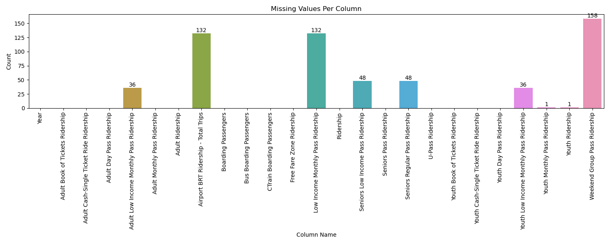

# Data Processing Report  
**Dataset:** Calgary_Transit_Ridership.csv  
**Total Rows:** 178  
**Total Columns:** 27  

## Summary Table
| Validation Check      | Value |
|----------------------|------:|
| **Total Duplicate Rows** | 0 |

## Validation Details
| Column Name                             |   Missing Values |   Negative Values |   Zero Values |
|-----------------------------------------|------------------|-------------------|---------------|
| Year                                    |                0 |                 0 |             0 |
| Month                                   |                0 |                 0 |             0 |
| Adult Book of Tickets Ridership         |                0 |                 0 |             0 |
| Adult Cash-Single Ticket Ride Ridership |                0 |                 0 |             0 |
| Adult Day Pass Ridership                |                0 |                 2 |             0 |
| Adult Low Income Monthly Pass Ridership |               36 |                 0 |             0 |
| Adult Monthly Pass Ridership            |                0 |                 0 |             0 |
| Adult Ridership                         |                0 |                 0 |             0 |
| Airport BRT Ridership - Total Trips     |              132 |                 0 |            16 |
| Boarding Passengers                     |                0 |                 0 |             0 |
| Bus Boarding Passengers                 |                0 |                 0 |             0 |
| CTrain Boarding Passengers              |                0 |                 0 |             0 |
| Free Fare Zone Ridership                |                0 |                 0 |             0 |
| Low Income Monthly Pass Ridership       |              132 |                 0 |             0 |
| Ridership                               |                0 |                 0 |             0 |
| Seniors Low Income Pass Ridership       |               48 |                 0 |             0 |
| Seniors Pass Ridership                  |                0 |                 0 |             0 |
| Seniors Regular Pass Ridership          |               48 |                 0 |             0 |
| U-Pass Ridership                        |                0 |                 0 |            12 |
| Youth Book of Tickets Ridership         |                0 |                 9 |             0 |
| Youth Cash-Single Ticket Ride Ridership |                0 |                 0 |             9 |
| Youth Day Pass Ridership                |                0 |                10 |             0 |
| Youth Low Income Monthly Pass Ridership |               36 |                 0 |             3 |
| Youth Monthly Pass Ridership            |                1 |                 0 |             0 |
| Youth Ridership                         |                1 |                 0 |             0 |
| Weekend Group Pass Ridership            |              158 |                 0 |             0 |
| Date                                    |                0 |                 0 |             0 |

## Visualizations

### Missing Values Plots
The missing values are mostly before 2021, with "Weekend Group Pass Ridership" (158) and "Low Income Monthly Pass Ridership" (132) being the most affected. Some columns show 12 missing values per year, suggesting systematic gaps.

### Zero Values Plots
Zero values are concentrated in "Airport BRT Ridership - Total Trips" (16), "Seniors Regular Pass Ridership" (12), and "Youth Book of Tickets Ridership" (9), suggesting periods of no reported ridership, possibly due to service suspensions or low demand. The majority of zero values appear in recent years (2020-2024), likely due to pandemic-related impacts or reporting gaps.

### Negative Values Heatmap
Negative values are rare but found mainly in "Youth Day Pass Ridership" (10), "Youth Book of Tickets Ridership" (9), and "Adult Day Pass Ridership" (2). These may indicate data entry errors or adjustments. Most negative values appear before 2021, with a few scattered cases in later years, suggesting inconsistencies in earlier data collection

## Data Cleaning Strategy
To ensure the **ridership data** is clean and ready for analysis, four key checks were performed:
1. **Duplicates:** There were 0 duplicate rows in the dataset.
2. **Missing Values:**
    - The columns **`Airport BRT Ridership`** and **`Weekend Group Pass Ridership`** had missing values in almost all rows and were **removed** as they contribute minimally to ridership trends.
    - **Removing data from 2010 to 2014** significantly reduced missing values while keeping the analysis focused on recent trends.
    - Columns with only **one missing value** were **imputed using the mean ridership for the same month in previous years**, ensuring continuity in data.
3. **Zero Values:**
    - **`U-Pass Ridership`** had **zero values during the COVID-19 pandemic** due to university closures. These are **retained**, as they reflect real-world impacts.
    - **`Youth Cash-Single Ticket Ride Ridership`** had **zero values in 2014**, but since it contributes minimally to overall ridership, these are **ignored**.
4. **Negative Values:**
    - Since we do **not have access to SMEs**, these values cannot be **confirmed or corrected based on domain knowledge**.
    - Only **three columns** contained negative values, as shown in the **visualizations**.
    - These columns **contributed minimally** to total ridership each year.
    - **Dropping these columns** is a reasonable choice to ensure data integrity.

The processed dataset is available at [this link](../data/processed/Calgary_Transit_Ridership_Processed.csv).
    